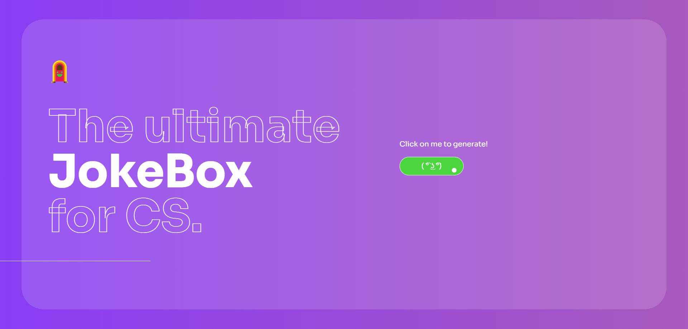

  <h1>
      
      <a href="https://maggyprotasio.github.io/JokeBox/">JokeBox</a>
  </h1>
  
  <h3>Modern responsive website that generates CS jokes using JokeAPI</h3>
  
Check it out to have a laugh :) 

  
  

